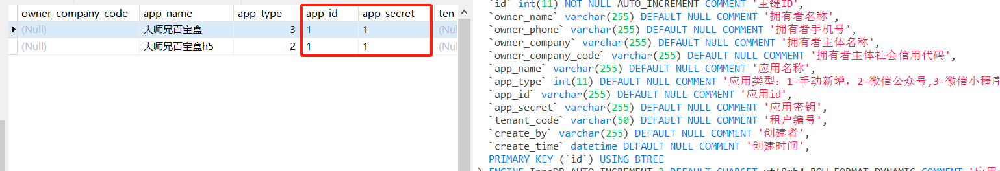
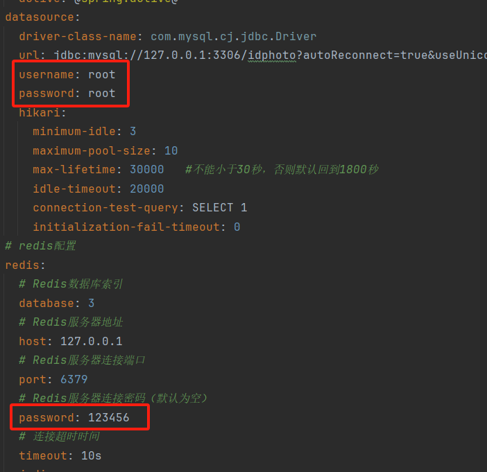
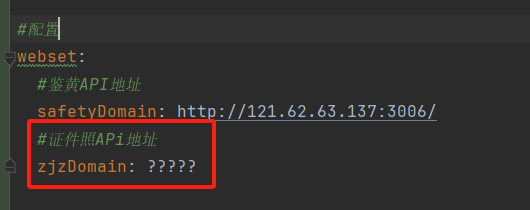

### 证件照制作、证件照换底色、小一寸、一寸、自定义尺寸等证件照生成，AI抠图切图、全开源免费！！兼容微信H5、微信小程序两套部署！！

# 预览：

# 项目介绍

# 
证件照伴侣

我给你的，就是我想要的，我爱你的方式，就是我希望被爱的方式.

[//]: # (
喜欢就点个Star吧
)

**相关项目**：
- 小程序前端请前往：
- gitee: https://gitee.com/wmlcjj/idphoto-uniapp
- github: https://github.com/903249871/idphoto-uniapp
------

#  📦前提准备

本项目基于HivisionIDPhotos的2024.09.10更新的版本进行对接开发

理论HivisionIDPhotos不改变入参和返回，即可直接使用最新版

1. 2024.09.10的HivisionIDPhotos（以内置MTCNN+hivision_modnet模型）下载：https://wwba.lanzouq.com/it7LW29ue8yd

2. 鉴黄APi端下载：https://github.com/no1xuan/zjzNsfw

注意:

1. **鉴黄模型目前不怎么精准，建议在小程序过审时打开，其它时间关闭**

# 🤩功能

##### 现有功能：

- 无需单独购买API
- 本地0成本处理
- 无限免费调用API
- 支持水印
- 支持自由开关鉴黄
- 自带758+尺寸
- 支持自定义尺寸
- 支持自定义更换背景色
- 支持普通下载和高清下载
- 支持引导用户打开保存相册
- 支持相机拍摄和相册选择
- 支持本地存储、阿里云OSS、腾讯云COS等各种对象存储云平台（支持私有存储、防止防盗刷）
- 支持微信H5、微信小程序、其他小程序没测试过
- 无感登录

 

##### 排期功能列表：

- 14种衣服自由换装
- 更换最新HivisionIDPhotos模型
- 物品自定义抠图
- 黑白图片上色
- 粘土风写真生成
- 管理员的后台管理
- 流量主

# 🔧部署

需要：

1. jdk1.8+mysql8.0+redis7.2.4（mysql5.7也行）

2. Mysql导入1.sql，然后打开sys_app表，把app_id，app_secret配置了，至此Mysql配置完毕

3. IDEA导入项目，打开application.yml，按下图进行一步步配置

##### 修改mysql和Redis：

##### 修改证件照服务API地址：

换成你的APi地址即可，然后就可以打包了

如果不想部署API，可以使用我的：

鉴黄APi：http://121.62.63.137:3006/

证件照APi:  可以找我拿

## ⚡️注意

1. 理论上支持本地存储，但是作者还没测试，对象存储已经过测试，作者用的是腾讯cos，按需测试哈
2. 鉴黄模型目前不怎么精准，建议在小程序过审时打开，其它时间关闭
3. 部署自已鉴黄和证件照APi时，不建议开设外网，防止被抓接口后滥用，yml里面配置127.0.0.1即可本地链接，速度还快，还安全
4. 为什么不把APi地址等参数放入数据库来配置？答：频繁使用的值，不建议与Mysql频繁握手
5. 当你部署到云上（服务器）时，别忘记配置你的小程序域名(如图) 

 

## 📧其它

您可以通过以下方式联系我:

微信：cjj113377

### 特别鸣谢

基于此项目二开：https://github.com/no1xuan/HivisionIDPhotos-wechat-weapp

开源AI照证件照服务：https://github.com/Zeyi-Lin/HivisionIDPhotos
